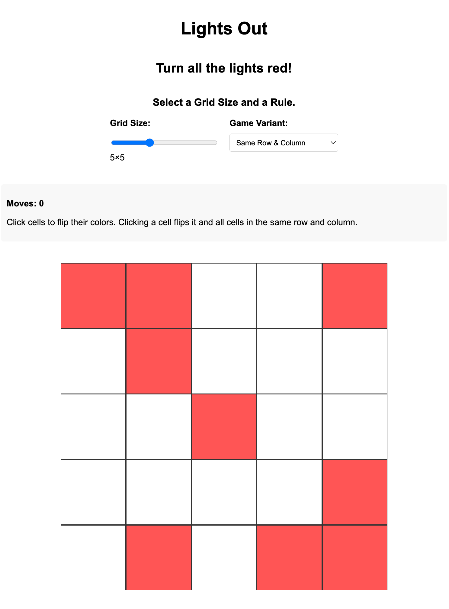

# Lights_Out

[Lights Out](https://mathworld.wolfram.com/LightsOutPuzzle.html) is a mathematical puzzle that lives on an $n \times n$ where each cell of the grid is one of two colors: either *red* or *white*. The goal is to eventually get all the cells in the grid to be red. 

The original setup involves a $5 \times 5$ board, on whose cells a user may "click." Clicking a cell will not only flip the color of that cell, but also flip the color of all the neigbors to its north, east, south, and west (call this rule `Adjacent`). But the original variant of the game introduced to me followed a different rule `Same Row & Col`: any click flips the color of all cells sharing the same row or column as the clicked cell. Another variant involves all cells sharing the same diagonal (without any wrapping), called `Diagonals`. 

## Implementation

Implemented in TypeScript with strict mode enabled. The project utilizes static type-checking, union types, and interfaces. 

## Video

Watch the teaser video I made for Lights Out in [Manim](https://github.com/RaymondTana/manim_videos).

<iframe width="560" height="315" 
    src="https://www.youtube.com/embed/hg7bFiNvHS0?si=qwPpczpLm0vNYWDL" 
    title="YouTube video player" frameborder="0" 
    allow="accelerometer; autoplay; clipboard-write; encrypted-media; gyroscope; picture-in-picture" 
    allowfullscreen>
</iframe>